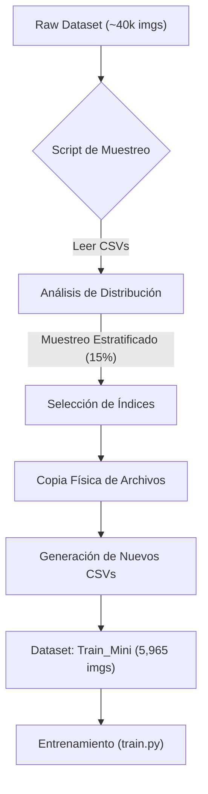

# Semana 1: Reproducibilidad, Ingeniería de Datos y Línea Base


-blue)


**Objetivos del Sprint**
El objetivo principal de esta primera semana fue establecer un entorno de desarrollo estable, verificar la reproducibilidad del código base y generar métricas de referencia (*baseline*). Debido al volumen masivo del dataset original (~40,000 imágenes) y las limitaciones de recursos para iteraciones rápidas, el esfuerzo se centró en la **Ingeniería de Datos** para crear un entorno de entrenamiento eficiente y representativo.

---

**1.Estrategia de Sub-Muestreo**

Para viabilizar el entrenamiento y la validación rápida de hipótesis, se optó por trabajar con un subconjunto representativo de los datos. Se desarrolló un pipeline de extracción automatizado.




### 1.1. Generación del Subset (`Subset.py`)
Se implementó un script que reduce el dataset al **15%** de su tamaño original para agilizar las iteraciones de entrenamiento sin comprometer la estadística.

* **Metodología:** Muestreo Estratificado basado en el `task_id`.
* **Propósito:** Garantizar que las tareas minoritarias (como Regresión, que representa $< 8\%$ de los datos) no pierdan representatividad estadística.
* **Integridad:** Verificación de existencia física de imágenes y máscaras.
* **Resultado:** Dataset final de **5,965 muestras** sin errores de integridad.

### 1.2. Distribución Resultante
El subconjunto mantiene rigurosamente las proporciones del dataset original:

* **Clasificación:** ~41.1%
* **Segmentación:** ~40.2%
* **Detección:** ~10.9%
* **Regresión:** ~7.7%

---

## 2. Arquitectura y Entrenamiento

Se analizó y ejecutó la arquitectura definida en `model_factory.py`, confirmando el uso de un esquema de **Hard Parameter Sharing**.

* **Backbone Compartido:** EfficientNet-B4 (Pre-entrenado en ImageNet). Actúa como extractor universal de características.
* **Enrutamiento Lógico:**
    * *Ruta Global:* Las tareas de Clasificación y Regresión utilizan Pooling sobre los mapas de características profundos ($8 \times 8$).
    * *Ruta Espacial:* Las tareas de Segmentación y Detección activan un decodificador FPN (*Feature Pyramid Network*) para recuperar resolución espacial.

### Manejo de Desbalance
Se verificó la eficacia del `MultiTaskUniformSampler` en `train.py`. Este componente fue crucial para entrenar con el subconjunto estratificado, forzando al DataLoader a construir lotes homogéneos por tarea y equilibrando la frecuencia de actualización de pesos.

---

## 3. Resultados de la Línea Base (Baseline)

Se ejecutó el pipeline completo (Entrenamiento $\rightarrow$ Inferencia $\rightarrow$ Evaluación) sobre el subconjunto generado. A continuación, las métricas sobre el set de validación (20% del subset):

### 3.1. Resumen de Métricas

| Tarea | Métrica Principal | Resultado | Análisis Técnico |
| :--- | :--- | :--- | :--- |
| **Segmentación** | Dice Score (DSC) | **0.7983** | Rendimiento sólido. Excelente en anatomías grandes (`fetal_head` DSC $> 0.92$). |
| **Clasificación** | Accuracy | **90.80%** | La tarea con mejor convergencia gracias a la robustez del backbone. |
| **Detección** | IoU | **0.3982** | Área de oportunidad. El modelo base tiene dificultades con la localización precisa en rejilla. |
| **Regresión** | MAE | **90.44** | Convergencia lenta; la función de pérdida MSE muestra sensibilidad a valores atípicos. |

---

## 4. Estrategias Identificadas para Semana 2

Tras analizar el desempeño del modelo base, se han definido las siguientes acciones técnicas para mejorar el rendimiento en la próxima iteración:

### 4.1. Refinamiento de Funciones de Pérdida
El análisis de `train.py` sugiere cambios para manejar mejor la dificultad de las muestras:
* **Regresión:** Sustituir `MSELoss` por `SmoothL1Loss` para reducir la penalización excesiva de errores grandes y estabilizar el gradiente.
* **Detección:** Implementar `FocalLoss` para atacar el desbalance clase/fondo inherente en la detección basada en rejillas.

### 4.2. Aumentación de Datos Específica
El pipeline actual utiliza transformaciones genéricas. Se propone integrar transformaciones no rígidas en `albumentations` específicas para ultrasonido:
* **ElasticTransform & GridDistortion:** Para simular la variabilidad de tejidos blandos y deformaciones del transductor.

### 4.3. Optimización
* **Gradient Accumulation:** Implementar acumulación de gradientes para simular un `batch_size` efectivo mayor (actualmente limitado a 20 por VRAM), lo cual estabilizará las estadísticas de las capas de Batch Normalization.

---

## 5. Instrucciones de Reproducción

Para replicar estos resultados utilizando los scripts desarrollados:

**1. Generar el subconjunto de datos:**
```bash
# Asegura que la ruta SOURCE_ROOT en el script apunte a tus datos originales
python src/create_subset.py
```

2. Entrenar el modelo: Asegúrate de apuntar DATA_ROOT_PATH en train.py a la carpeta train_mini.

```bash

python src/train.py
```
3. Evaluar resultados:

```bash

python src/model.py    # Inferencia
python src/evaluate.py # Cálculo de métricas
```
